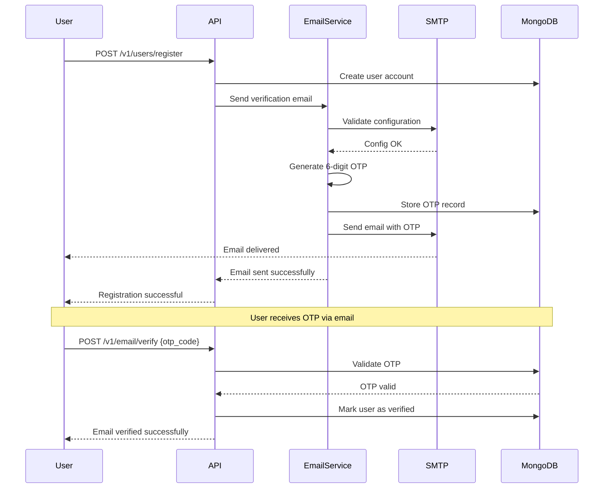

# Email Verification Setup Guide

**PromptEnchanter Email Verification System**  
Complete guide to configuring email verification with various SMTP providers

---

## Table of Contents

1. [Overview](#overview)
2. [Prerequisites](#prerequisites)
3. [Configuration Options](#configuration-options)
4. [Provider-Specific Setup](#provider-specific-setup)
   - [Gmail](#gmail-setup)
   - [SendGrid](#sendgrid-setup)
   - [Amazon SES](#amazon-ses-setup)
   - [Mailgun](#mailgun-setup)
   - [Custom SMTP](#custom-smtp-setup)
5. [Environment Variables](#environment-variables)
6. [Testing Email Configuration](#testing-email-configuration)
7. [Troubleshooting](#troubleshooting)
8. [Email Verification Flow](#email-verification-flow)
9. [Security Considerations](#security-considerations)

---

## Overview

PromptEnchanter includes an optional email verification system that:
- Sends OTP (One-Time Password) codes to users upon registration
- Validates email addresses before granting full access (if enabled)
- Supports multiple SMTP providers
- Includes automatic retry logic and error handling
- Allows profile access even without email verification (by default)

### Key Features

✅ **6-digit OTP codes** with configurable expiry  
✅ **Rate limiting** - Maximum 3 verification emails per day  
✅ **Retry mechanism** - Automatic retry with exponential backoff  
✅ **Multiple providers** - Gmail, SendGrid, SES, Mailgun, and more  
✅ **Graceful fallback** - Registration succeeds even if email fails  
✅ **Debug mode** - Detailed SMTP logging when DEBUG=true

---

## Prerequisites

Before setting up email verification, you need:

1. **SMTP Provider Account** - Gmail, SendGrid, AWS SES, or any SMTP service
2. **SMTP Credentials** - Username and password/app-specific password
3. **Environment Configuration** - Access to `.env` file

---

## Configuration Options

Email verification can be enabled or disabled via environment variable:

```env
# Enable or disable email verification
EMAIL_VERIFICATION_ENABLED=true

# If disabled, users are automatically marked as verified
# If enabled, users must verify their email to access certain features
```

**Important Note**: Even with email verification enabled, users can still:
- Access their profile
- View account information
- Update profile details

Verification is only required for sensitive operations (configurable per endpoint).

---

## Provider-Specific Setup

### Gmail Setup

Gmail is the easiest to set up for development and testing.

#### Step 1: Enable 2-Factor Authentication

1. Go to [Google Account Security](https://myaccount.google.com/security)
2. Enable 2-Factor Authentication (required for App Passwords)

#### Step 2: Generate App Password

1. Go to [App Passwords](https://myaccount.google.com/apppasswords)
2. Select "Mail" as the app
3. Select "Other" as the device, enter "PromptEnchanter"
4. Click "Generate"
5. Copy the 16-character password (no spaces)

#### Step 3: Configure Environment Variables

```env
# Gmail SMTP Configuration
SMTP_HOST=smtp.gmail.com
SMTP_PORT=587
SMTP_USERNAME=your-email@gmail.com
SMTP_PASSWORD=your-16-char-app-password
SMTP_USE_TLS=true
FROM_EMAIL=your-email@gmail.com
```

#### Gmail Limitations

- **Sending Limit**: 500 emails per day (2000 for Google Workspace)
- **Rate Limit**: 100 recipients per message
- **Best For**: Development, testing, small deployments

---

### SendGrid Setup

SendGrid offers reliable email delivery with generous free tier.

#### Step 1: Create SendGrid Account

1. Sign up at [SendGrid](https://signup.sendgrid.com/)
2. Verify your email address
3. Complete sender verification

#### Step 2: Create API Key

1. Go to [API Keys](https://app.sendgrid.com/settings/api_keys)
2. Click "Create API Key"
3. Select "Full Access" or "Restricted Access" (Mail Send only)
4. Copy the API key immediately (shown only once)

#### Step 3: Configure Environment Variables

```env
# SendGrid SMTP Configuration
SMTP_HOST=smtp.sendgrid.net
SMTP_PORT=587
SMTP_USERNAME=apikey
SMTP_PASSWORD=your-sendgrid-api-key
SMTP_USE_TLS=true
FROM_EMAIL=verified-sender@yourdomain.com
```

#### Step 4: Verify Sender Email

1. Go to [Sender Authentication](https://app.sendgrid.com/settings/sender_auth)
2. Add your sender email
3. Verify via email confirmation

#### SendGrid Benefits

- **Free Tier**: 100 emails per day forever
- **Paid Plans**: Start at $19.95/month for 50,000 emails
- **Deliverability**: Excellent inbox placement
- **Best For**: Production, medium to large deployments

---

### Amazon SES Setup

AWS Simple Email Service offers low-cost, scalable email delivery.

#### Step 1: Setup AWS Account

1. Create AWS account at [AWS Console](https://console.aws.amazon.com/)
2. Go to [Amazon SES](https://console.aws.amazon.com/ses/)
3. Request production access (initially in sandbox mode)

#### Step 2: Verify Email or Domain

1. In SES Console, go to "Verified Identities"
2. Click "Create Identity"
3. Choose "Email address" or "Domain"
4. Complete verification process

#### Step 3: Create SMTP Credentials

1. Go to "SMTP Settings" in SES Console
2. Click "Create SMTP Credentials"
3. Download credentials CSV file
4. Note your SMTP endpoint (varies by region)

#### Step 4: Configure Environment Variables

```env
# AWS SES SMTP Configuration
SMTP_HOST=email-smtp.us-east-1.amazonaws.com
SMTP_PORT=587
SMTP_USERNAME=your-smtp-username
SMTP_PASSWORD=your-smtp-password
SMTP_USE_TLS=true
FROM_EMAIL=verified@yourdomain.com
```

#### SES Pricing

- **Free Tier**: 62,000 emails per month (if sent from EC2)
- **Paid**: $0.10 per 1,000 emails
- **Best For**: AWS-hosted applications, cost-sensitive deployments

---

### Mailgun Setup

Mailgun offers powerful email API with excellent deliverability.

#### Step 1: Create Mailgun Account

1. Sign up at [Mailgun](https://signup.mailgun.com/)
2. Verify your email
3. Add payment method (required even for free tier)

#### Step 2: Setup Domain

1. Go to "Sending" → "Domains"
2. Add your domain
3. Configure DNS records (MX, TXT, CNAME)
4. Wait for verification

#### Step 3: Get SMTP Credentials

1. Go to "Sending" → "Domain Settings"
2. Click "SMTP Credentials"
3. Create new credentials or use default

#### Step 4: Configure Environment Variables

```env
# Mailgun SMTP Configuration
SMTP_HOST=smtp.mailgun.org
SMTP_PORT=587
SMTP_USERNAME=postmaster@your-domain.mailgun.org
SMTP_PASSWORD=your-mailgun-password
SMTP_USE_TLS=true
FROM_EMAIL=noreply@your-domain.com
```

#### Mailgun Features

- **Free Tier**: 5,000 emails per month for 3 months
- **Pay As You Go**: $0.80 per 1,000 emails after trial
- **Best For**: API-first approach, detailed analytics needed

---

### Custom SMTP Setup

You can use any SMTP server that supports authentication.

#### Configuration Template

```env
# Custom SMTP Configuration
SMTP_HOST=smtp.yourprovider.com
SMTP_PORT=587              # or 465 for SSL
SMTP_USERNAME=your-username
SMTP_PASSWORD=your-password
SMTP_USE_TLS=true          # true for STARTTLS (port 587), false for SSL (port 465)
FROM_EMAIL=noreply@yourdomain.com
```

#### Common SMTP Ports

- **587** - STARTTLS (recommended, set SMTP_USE_TLS=true)
- **465** - SSL/TLS (set SMTP_USE_TLS=false)
- **25** - Unencrypted (not recommended, often blocked)

---

## Environment Variables

Complete list of email-related environment variables:

```env
# ===== EMAIL VERIFICATION SETTINGS =====

# Enable/disable email verification
EMAIL_VERIFICATION_ENABLED=true

# SMTP Server Configuration
SMTP_HOST=smtp.gmail.com
SMTP_PORT=587
SMTP_USERNAME=your-email@gmail.com
SMTP_PASSWORD=your-app-password
SMTP_USE_TLS=true
FROM_EMAIL=noreply@promptenchanter.com

# Verification Settings
EMAIL_VERIFICATION_TOKEN_EXPIRY_HOURS=24
EMAIL_VERIFICATION_RESEND_LIMIT_PER_DAY=3
EMAIL_VERIFICATION_OTP_LENGTH=6

# Debug Settings (enable SMTP debug output)
DEBUG=false
LOG_LEVEL=INFO
```

### Environment Variable Descriptions

| Variable | Description | Default | Required |
|----------|-------------|---------|----------|
| `EMAIL_VERIFICATION_ENABLED` | Enable email verification | `false` | No |
| `SMTP_HOST` | SMTP server hostname | - | Yes (if enabled) |
| `SMTP_PORT` | SMTP server port | `587` | Yes (if enabled) |
| `SMTP_USERNAME` | SMTP username/email | - | Yes (if enabled) |
| `SMTP_PASSWORD` | SMTP password/API key | - | Yes (if enabled) |
| `SMTP_USE_TLS` | Use STARTTLS encryption | `true` | No |
| `FROM_EMAIL` | Sender email address | `noreply@promptenchanter.com` | No |
| `EMAIL_VERIFICATION_TOKEN_EXPIRY_HOURS` | OTP expiry time | `24` | No |
| `EMAIL_VERIFICATION_RESEND_LIMIT_PER_DAY` | Max resend attempts | `3` | No |
| `EMAIL_VERIFICATION_OTP_LENGTH` | OTP code length | `6` | No |

---

## Testing Email Configuration

### Method 1: Startup Validation

The system automatically validates SMTP configuration on startup:

```bash
# Start the application
python main.py

# Check logs for SMTP validation
tail -f logs/promptenchanter.log | grep -i smtp
```

### Method 2: Test Registration

```bash
# Register a test user
curl -X POST "http://localhost:8000/v1/users/register" \
  -H "Content-Type: application/json" \
  -d '{
    "username": "testuser",
    "name": "Test User",
    "email": "test@example.com",
    "password": "SecurePass123!"
  }'

# Check email inbox for OTP code
# Check logs for email send confirmation
```

### Method 3: Manual SMTP Test (Python)

Create a test script `test_smtp.py`:

```python
import smtplib
from email.mime.text import MIMEText

# Your SMTP settings
SMTP_HOST = "smtp.gmail.com"
SMTP_PORT = 587
SMTP_USERNAME = "your-email@gmail.com"
SMTP_PASSWORD = "your-app-password"

# Test email
msg = MIMEText("Test email from PromptEnchanter")
msg['Subject'] = 'SMTP Test'
msg['From'] = SMTP_USERNAME
msg['To'] = "your-email@gmail.com"

try:
    server = smtplib.SMTP(SMTP_HOST, SMTP_PORT, timeout=10)
    server.starttls()
    server.login(SMTP_USERNAME, SMTP_PASSWORD)
    server.send_message(msg)
    server.quit()
    print("✅ Email sent successfully!")
except Exception as e:
    print(f"❌ Error: {e}")
```

Run the test:

```bash
python test_smtp.py
```

---

## Troubleshooting

### Common Issues and Solutions

#### 1. "SMTP Authentication Failed"

**Symptoms:**
```
SMTP Authentication failed: (535, b'5.7.8 Username and Password not accepted')
```

**Solutions:**
- **Gmail**: Ensure 2FA is enabled and you're using an App Password, not your regular password
- **SendGrid**: Use "apikey" as username (literal string), not your email
- **Check credentials**: Verify username and password are correct
- **No spaces**: Ensure no extra spaces in credentials

#### 2. "SMTP Connection Failed"

**Symptoms:**
```
Failed to connect to SMTP server smtp.gmail.com:587
```

**Solutions:**
- **Check internet**: Ensure server has internet connectivity
- **Firewall**: Check if port 587 (or 465) is open
- **Correct host**: Verify SMTP_HOST is correct
- **Test connection**: `telnet smtp.gmail.com 587`

#### 3. "SSL/TLS Error"

**Symptoms:**
```
SSL: CERTIFICATE_VERIFY_FAILED
```

**Solutions:**
- **Update certificates**: Update system CA certificates
  ```bash
  # Ubuntu/Debian
  sudo apt-get update
  sudo apt-get install ca-certificates
  
  # macOS
  brew install ca-certificates
  ```
- **Python certificates**: Update certifi package
  ```bash
  pip install --upgrade certifi
  ```

#### 4. "Email Not Received"

**Symptoms:**
- No error in logs
- Email not in inbox

**Solutions:**
- **Check spam folder**: Verification emails often land in spam
- **Verify sender**: Ensure FROM_EMAIL is verified with provider
- **Check limits**: Verify you haven't hit daily sending limits
- **Wait**: Some providers have delays, wait 5-10 minutes
- **Check logs**: Look for "Email sent successfully" in logs

#### 5. "Rate Limit Exceeded"

**Symptoms:**
```
Daily limit of 3 verification emails exceeded
```

**Solutions:**
- **Wait**: Limits reset at midnight UTC
- **Adjust config**: Increase `EMAIL_VERIFICATION_RESEND_LIMIT_PER_DAY`
- **Clear database**: Remove old verification records (development only)

#### 6. "Email Service Not Configured"

**Symptoms:**
```
Email service not configured, verification skipped
```

**Solutions:**
- **Check .env**: Ensure all SMTP variables are set
- **Reload config**: Restart application after changing .env
- **Verify format**: Check for typos in environment variables

---

## Email Verification Flow

### User Registration Flow



### Verification States

1. **Unverified** (`is_verified: false`)
   - Can access profile
   - Can update account settings
   - Limited API access (depending on endpoint configuration)

2. **Verified** (`is_verified: true`)
   - Full API access
   - All features unlocked
   - Trusted user status

### OTP Characteristics

- **Length**: 6 digits (configurable)
- **Expiry**: 24 hours (configurable)
- **Attempts**: Maximum 5 verification attempts per OTP
- **Resend**: Maximum 3 resends per day
- **Format**: Numeric only (e.g., "123456")

---

## Security Considerations

### Best Practices

1. **Use App Passwords**
   - Never use your main email password
   - Use provider-specific app passwords

2. **Secure Credentials**
   - Store SMTP credentials in environment variables
   - Never commit `.env` file to version control
   - Use secrets management in production (AWS Secrets Manager, etc.)

3. **Enable TLS**
   - Always use TLS/SSL encryption
   - Prefer port 587 with STARTTLS over port 25

4. **Verify Sender Domain**
   - Use SPF, DKIM, and DMARC records
   - Verify domain with your email provider
   - Use a dedicated subdomain (e.g., `mail.yourdomain.com`)

5. **Rate Limiting**
   - Keep resend limits to prevent abuse
   - Monitor for unusual sending patterns
   - Implement IP-based rate limiting

6. **OTP Security**
   - Use cryptographically secure random generation
   - Set reasonable expiry times
   - Limit verification attempts
   - Invalidate OTP after successful verification

### Production Recommendations

1. **Use Dedicated Email Service**
   - Don't use Gmail for production
   - Choose SendGrid, SES, or Mailgun
   - Set up monitoring and alerts

2. **Configure Email Authentication**
   ```
   # SPF Record
   v=spf1 include:_spf.google.com ~all
   
   # DKIM Setup
   Follow provider-specific instructions
   
   # DMARC Policy
   v=DMARC1; p=quarantine; rua=mailto:dmarc@yourdomain.com
   ```

3. **Monitor Email Delivery**
   - Track bounce rates
   - Monitor spam complaints
   - Set up delivery notifications

4. **Handle Failures Gracefully**
   - Don't block registration on email failure
   - Log all email errors
   - Implement retry with exponential backoff
   - Provide alternative verification methods

---

## Quick Reference

### Gmail Quick Setup

```env
EMAIL_VERIFICATION_ENABLED=true
SMTP_HOST=smtp.gmail.com
SMTP_PORT=587
SMTP_USERNAME=your-email@gmail.com
SMTP_PASSWORD=your-16-char-app-password
SMTP_USE_TLS=true
FROM_EMAIL=your-email@gmail.com
```

### SendGrid Quick Setup

```env
EMAIL_VERIFICATION_ENABLED=true
SMTP_HOST=smtp.sendgrid.net
SMTP_PORT=587
SMTP_USERNAME=apikey
SMTP_PASSWORD=your-sendgrid-api-key
SMTP_USE_TLS=true
FROM_EMAIL=verified@yourdomain.com
```

### Disable Email Verification

```env
EMAIL_VERIFICATION_ENABLED=false
```

---

## Support

For additional help:

1. **Check Logs**: `tail -f logs/promptenchanter.log`
2. **Enable Debug**: Set `DEBUG=true` in `.env`
3. **Test SMTP**: Use the manual test script above
4. **Provider Docs**: Check your SMTP provider's documentation
5. **GitHub Issues**: Report bugs or request features

---

**Last Updated**: October 7, 2025  
**Version**: 2.0.0
